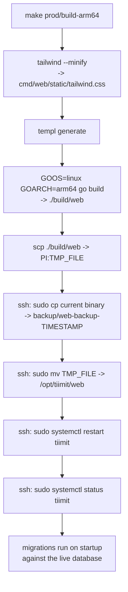

# Tiimit Deployment Guide

How Tiimit is deployed to a Raspberry Pi running Ubuntu Server, and what to do when a
deployment goes wrong.

## Overview

| Thing | Value |
|---|---|
| Binary | `/opt/tiimit/web` (owned by root) |
| Backups | `/opt/tiimit/backup/` |
| Database | `/var/lib/tiimit/tiimit.db` (owned by `tiimit`) |
| Service | systemd unit `tiimit.service` |
| Process user | `tiimit` (system user, no login shell) |
| Listen address | `127.0.0.1:8080` — **hardcoded**, see [Known gaps](#known-gaps--improvement-backlog) |
| Target arch | `arm64` (Pi 3/4/5 running 64-bit Ubuntu — confirm with `uname -m`) |

### What ships inside the binary

A deploy copies **one file**. Everything the app needs at runtime is compiled into it:

- **Static assets** — `cmd/web/static/` via `//go:embed static` ([cmd/web/main.go:14](../cmd/web/main.go#L14)).
  This includes `tailwind.css`, which `make prod/build-arm64` regenerates before compiling.
  There is no separate step to deploy CSS.
- **Database migrations** — `sql/schema/*.sql` via `//go:embed schema/*.sql`
  ([sql/migrations.go:5](../sql/migrations.go#L5)). They run automatically on every startup
  through goose (`db.RunMigrations`).
- **templ templates** — generated to `*_templ.go` at build time and compiled in.

Consequence worth remembering: **a deploy is also a migration.** The new binary migrates the
live database the moment systemd starts it, and there is currently no automatic backup of the
database beforehand.

## One-time server setup

### 1. Create the service user

```bash
sudo useradd --system --no-create-home --shell /usr/sbin/nologin tiimit
```

A system user with no home directory and no login shell — it exists only to own the running
process, and nobody can SSH in as it.

### 2. Create the directory structure

```bash
# Binary + backups (owned by root, so the service user cannot modify the binary)
sudo mkdir -p /opt/tiimit/backup
sudo chown -R root:root /opt/tiimit
sudo chmod 755 /opt/tiimit /opt/tiimit/backup

# Database directory (owned by the service user, which needs write access for SQLite)
sudo mkdir -p /var/lib/tiimit
sudo chown tiimit:tiimit /var/lib/tiimit
sudo chmod 755 /var/lib/tiimit
```

`/opt/tiimit/backup` is required — `deploy.sh` copies the current binary there on every run and
will fail if it is missing.

### 3. Install the systemd service

Create `/etc/systemd/system/tiimit.service`:

```ini
[Unit]
Description=Tiimit web application
After=network.target

[Service]
Type=simple
User=tiimit
WorkingDirectory=/opt/tiimit
ExecStart=/opt/tiimit/web
Restart=on-failure
StandardOutput=journal
StandardError=journal

Environment="DB_PATH=/var/lib/tiimit/tiimit.db"
Environment="ENV=production"

[Install]
WantedBy=multi-user.target
```

```bash
sudo systemctl daemon-reload
sudo systemctl enable tiimit
```

Notes on the environment variables:

- `DB_PATH` is read and required.
- `ENV=production` is currently **ignored** — the app hardcodes `env: "development"`
  ([cmd/web/main.go:44](../cmd/web/main.go#L44)).
- `POSTHOG_API_KEY` is not set here, so analytics is disabled in production. The app logs a
  warning and runs normally.
- The app calls `godotenv.Load()` at startup and logs `failed to load .env file` when there is
  no `.env` in the working directory. This is harmless — systemd supplies the variables — but
  it does mean a scary-looking line in the log on every start.

### 4. Grant passwordless sudo for the deploy commands

`deploy.sh` runs non-interactively, so the SSH user needs to run a few specific commands as root
without a password prompt. Create the drop-in with `visudo`, which syntax-checks before saving:

```bash
sudo visudo -f /etc/sudoers.d/tiimit-deploy
```

```
<deploy-user> ALL=(ALL) NOPASSWD: \
/usr/bin/mv /tmp/tiimit-web /opt/tiimit/web, \
/usr/bin/systemctl restart tiimit, \
/usr/bin/systemctl status tiimit, \
/usr/bin/systemctl stop tiimit
```

**These rules are a second copy of your deployment configuration.** sudo matches the *entire*
command line, arguments included — so the paths here must match `TMP_FILE` and `TARGET_DIR` in
`.deploy.conf` exactly. Change one without the other and the deploy breaks (see
[Troubleshooting](#sudo-a-terminal-is-required-to-read-the-password)).

Two gotchas:

- Files in `/etc/sudoers.d/` whose names contain a `.` or end in `~` are **silently ignored** by
  sudo (`sudoers(5)`). Name the file `tiimit-deploy`, not `tiimit-deploy.conf`.
- The `*` in the backup rule matches any characters **including `/`**, which makes the rule
  broader than it looks. See [Known gaps](#known-gaps--improvement-backlog), item 4.

Verify a specific command is permitted without running it:

```bash
sudo -n -l /usr/bin/mv /tmp/tiimit-web /opt/tiimit/web
```

## Deploying

### Configuration

Copy [.deploy.conf.example](../.deploy.conf.example) to `.deploy.conf` (gitignored) and fill in:

```bash
PI_USER="your-ssh-user"
PI_IP="192.168.1.50"
TMP_FILE="/tmp/tiimit-web"     # full path to a FILE, not a directory
TARGET_DIR="/opt/tiimit"
```

`TMP_FILE` must be a full file path. Using a directory here is what caused the
`mv: cannot stat ...: Not a directory` failure documented below.

### Running it

```bash
./deploy.sh
```

### What it actually does



The build steps live in the [Makefile](../Makefile) (`prod/build-arm64` → `prod/tailwind` +
`prod/build-server-arm64`). The remote steps run over a single SSH connection from
[deploy.sh](../deploy.sh).

**The script does not stop on failure.** There is no `set -e`, so a failed build, a failed copy,
or a failed install still proceeds to restart the service — which then reports
`active (running)` while running the *old* binary. Read the whole output, not just the green
status at the end. Fixing this is item 1 in the backlog.

## Verifying a deployment

```bash
ssh <user>@<pi> 'systemctl is-active tiimit'          # active | inactive | failed
ssh <user>@<pi> 'sudo journalctl -u tiimit -n 50'     # recent logs
ssh <user>@<pi> 'ls -l /opt/tiimit/web'               # timestamp should be seconds old
```

A healthy startup logs three lines:

```
failed to load .env file: open .env: no such file or directory   <- expected, harmless
goose: no migrations to run. current version: <version>
Starting server on address 127.0.0.1:8080
```

`systemctl status` immediately after a restart is a weak check — it reports `active` for a
process that is about to crash, and with `Restart=on-failure` a crash-looping service can look
alive. Checking the modification time of the binary is the reliable way to confirm the new
version actually landed.

## Rollback

Backups are timestamped copies in `/opt/tiimit/backup/`:

```bash
ssh <user>@<pi>
ls -lt /opt/tiimit/backup/                            # newest first
sudo cp /opt/tiimit/backup/web-backup-<TIMESTAMP> /opt/tiimit/web
sudo systemctl restart tiimit
```

**Rolling back the binary does not roll back the database.** If the bad deploy applied a goose
migration, the old binary will start against a newer schema. Recovering from that requires a
database backup, which nothing currently takes — backlog item 6.

## Manual deployment

If `deploy.sh` is broken and you need to ship anyway:

```bash
# On your machine
make prod/build-arm64
scp ./build/web <user>@<pi>:/tmp/tiimit-web

# On the Pi
sudo cp /opt/tiimit/web /opt/tiimit/backup/web-backup-$(date +%Y%m%d-%H%M%S)
sudo install -o root -g root -m 755 /tmp/tiimit-web /opt/tiimit/web
sudo systemctl restart tiimit
sudo journalctl -u tiimit -n 30
```

`install` does the copy, the ownership and the permissions in one command, which is why it is
preferable to `mv` — see backlog item 3.

## Troubleshooting

### `mv: cannot stat '/tmp/tiimit/web': Not a directory`

**Cause.** `TMP_FILE`/`TMP_DIR` pointed at a directory that no longer existed.
`scp`, `cp` and `mv` all decide what to do from what already exists at the destination: if it is
a directory, they copy *into* it; otherwise they treat the path as the name of the file to
create. When `/tmp/tiimit` was missing, `scp` created a *file* by that name — and exited 0, so
nothing looked wrong until the next command tried to walk through it as a directory and got
`ENOTDIR`.

**Why the directory disappeared.** `systemd-tmpfiles-clean.timer` runs daily and deletes entries
in `/tmp` older than a configured age (`D /tmp 1777 root root 30d` on some systems, 10 days on
others — check `/usr/lib/tmpfiles.d/tmp.conf`). Deploy less often than that window and the
directory is swept. See [tmpfiles.d(5)](https://www.freedesktop.org/software/systemd/man/tmpfiles.d.html).

**Fix.** `TMP_FILE` is now a full file path, so `scp` names the file explicitly and no longer
depends on anything pre-existing. The cleanup timer can still delete it between deploys — that
is fine, every deploy recreates it.

### `sudo: a terminal is required to read the password`

**Cause.** The command being run does not match any rule in `/etc/sudoers.d/tiimit-deploy`, so
sudo falls back to asking for a password — and a scripted SSH session has no terminal to ask on.
This happened after renaming `TMP_DIR` to `TMP_FILE`: the rule authorised
`/usr/bin/mv /tmp/tiimit/web /opt/tiimit`, while the script started running
`/usr/bin/mv /tmp/tiimit-web /opt/tiimit/web`.

**Fix.** Update the sudoers rule to match the new command line exactly, then confirm:

```bash
sudo -n -l /usr/bin/mv /tmp/tiimit-web /opt/tiimit/web    # prints the command if allowed
```

Any change to the remote commands in `deploy.sh` requires a matching sudoers change.

**Related:** `ssh -t` prints `Pseudo-terminal will not be allocated because stdin is not a
terminal` and allocates no PTY when ssh's own stdin is redirected (as it is with a `<< EOF`
heredoc, because the heredoc *is* stdin). A single `-t` is a no-op in that case. Passing the
remote script as an **argument** instead of on stdin leaves stdin attached to your terminal, so
`-t` works and sudo can prompt interactively.

### Service won't start after a deploy

```bash
sudo journalctl -u tiimit -n 100          # the actual error is almost always here
ls -l /opt/tiimit/web                     # right timestamp? executable? owned by root?
sudo systemd-analyze verify tiimit.service
sudo systemctl show tiimit | grep Environment
```

Run the binary by hand as the service user to separate app problems from systemd problems:

```bash
sudo -u tiimit DB_PATH=/var/lib/tiimit/tiimit.db /opt/tiimit/web
```

### Database permission problems

```bash
ls -la /var/lib/tiimit/
```

The directory and `tiimit.db` (plus any `-wal` / `-shm` files) must be owned by `tiimit:tiimit`:

```bash
sudo chown -R tiimit:tiimit /var/lib/tiimit
```

### Reset the database

Destroys all data — development and testing only:

```bash
sudo systemctl stop tiimit
sudo rm -f /var/lib/tiimit/tiimit.db*
sudo systemctl start tiimit    # migrations recreate the schema
```

## Monitoring

```bash
systemctl is-active tiimit                # active | inactive | failed
systemctl status tiimit                   # CPU/memory, recent log lines
du -h /var/lib/tiimit/tiimit.db           # database size
du -sh /opt/tiimit/backup/                # backup directory size (unbounded, see item 4)
sudo journalctl -u tiimit -f              # follow logs
```

## Known gaps / improvement backlog

Ordered by value. Items 1–3 are about not shipping broken deploys silently; 4–6 are about being
able to recover; 7+ are cleanups.

### Do first

- [x] **1. `deploy.sh` never fails.** No `set -e` locally or remotely, so every step runs
      regardless of what happened before — a failed build or install still restarts the service
      and prints a green status. Add `set -euo pipefail` at the top of the script, and `set -e`
      as the first remote command (the remote shell is a separate shell; the local setting does
      not reach it). `-u` also catches an unset `TMP_FILE` after a config rename, which would
      otherwise `scp` to the remote home directory.

- [x] **2. Quoting in the remote command block.** The remote script is now passed as a
      double-quoted argument, but the `echo` lines inside it use double quotes too, which
      terminate the outer string early. Use single quotes for the inner echoes, or escape them.
      Also drop `echo -e` — there are no escape sequences to interpret, and `-e` is printed
      literally by shells whose `echo` does not support it.

- [ ] **3. Install the binary properly.** `sudo mv ${TMP_FILE} ${TARGET_DIR}/web` has two
      problems. It preserves the SSH user's ownership, so `/opt/tiimit/web` ends up **not**
      owned by root, contradicting the security model in this guide. And if `/tmp` and `/opt`
      are on different filesystems, `mv` degrades to copy-then-delete, and copying over a
      *running* executable fails with `ETXTBSY` ("Text file busy"). Use
      `install -o root -g root -m 755` into a staging name inside the target directory, then
      `mv` it into place — a rename within one filesystem is atomic and leaves the running
      process's inode alone.

### Then

- [ ] **4. Fixed backup filename instead of a timestamp wildcard.** `web-backup-*` in sudoers
      matches `/` too, so the rule permits writing the binary to arbitrary paths via `..`
      (e.g. over a systemd unit file). Backups also accumulate forever on the SD card. A single
      `web-backup-previous` slot removes the wildcard, bounds the disk usage, and drops the
      `$(date)` call — which was expanding on the *local* machine anyway. One rollback slot is
      realistically all this app needs.

- [ ] **5. Verify the restart, and roll back automatically.** After `systemctl restart`, sleep a
      few seconds, then check `systemctl is-active --quiet tiimit` and `curl -fsS
      127.0.0.1:8080`. On failure, restore the backup and restart. This turns the backup from
      something you have to remember into something the script uses.

- [ ] **6. Back up the database before deploying.** Migrations run automatically at startup
      against the only copy of the data, with no undo. `sqlite3 /var/lib/tiimit/tiimit.db
      ".backup '/var/lib/tiimit/backup/tiimit-<timestamp>.db'"` before the restart closes the
      worst failure mode in the whole setup. Use `.backup`, not `cp` — it is safe against
      concurrent writes and handles the WAL files. This is the highest-value item on the list.

### Later

- [ ] **7. Keep the sudoers rules in the repo.** Copy the drop-in to `docs/` (or generate it) so
      the coupling between `.deploy.conf` and the Pi's sudo rules is visible in version control
      instead of being discovered by breakage.

- [ ] **8. Hardcoded config in `main.go`.** `address: "127.0.0.1:8080"` and `env: "development"`
      are literals ([cmd/web/main.go:40-46](../cmd/web/main.go#L40-L46)), so `Environment=` in
      the unit file has no effect and the app runs in development mode in production
      (dev-mode cache headers on static assets). Read both from the environment with defaults.

- [x] **9. Loopback-only bind.** The server listens on `127.0.0.1`, so it is unreachable from
      the LAN without a reverse proxy or SSH tunnel. Document how it is actually reached, and
      decide whether nginx + TLS is worth adding.

- [ ] **10. Quiet the `.env` warning in production.** Logging `failed to load .env file` on
      every start trains you to ignore startup errors. Log it at debug level, or only when the
      file exists but cannot be parsed.

- [ ] **11. Version stamping.** Nothing identifies which build is running. `go build
      -ldflags "-X main.version=$(git rev-parse --short HEAD)"` plus logging it at startup makes
      "is my change actually deployed?" answerable from the logs.

- [ ] **12. Automated database backups.** A cron job or systemd timer running `sqlite3 .backup`
      on a schedule, with a retention policy and a *tested* restore procedure.

- [x] **13. Run the tests before deploying.** `go test ./...` as the first step of `deploy.sh`,
      so a broken build cannot reach the Pi.

## Reference

- [systemd.service(5)](https://www.freedesktop.org/software/systemd/man/systemd.service.html)
- [sudoers(5)](https://www.sudo.ws/docs/man/sudoers.man/) — command matching, `sudoers.d` naming rules
- [tmpfiles.d(5)](https://www.freedesktop.org/software/systemd/man/tmpfiles.d.html) — `/tmp` cleanup
- [Go cross-compilation](https://go.dev/doc/install/source#environment)
- [goose](https://github.com/pressly/goose) — migrations
- [modernc.org/sqlite](https://pkg.go.dev/modernc.org/sqlite) — the pure-Go SQLite driver this project uses (no cgo)

## Server information

Kept out of the repo. Record locally: hostname, IP, OS version, `uname -m` output, SSH user and
port.

## Changelog

| Date | Change |
|---|---|
| 2026-08-15 | Guide rewritten against actual behaviour; added sudoers setup, two incident write-ups, improvement backlog |
